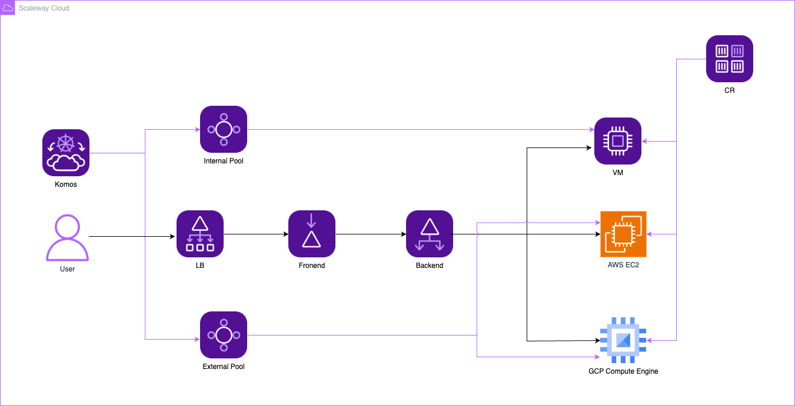

# Scaleway Kubernetes Komsos

Kubernetes Kosmos is an innovative method to implement multi-cloud strategy. Scaleway offers managed Kubernetes, which enables you to run pods across several cloud providers' resources. You can host your pods on Scaleway Instances or any other cloud provider's (GCP and AWS in this example) resources, including private cloud servers. 

   

    
   

## Prerequisites

1. Authentication for Terraform for all three cloud providers. Some CLI can be helpful in this case:  
 **Scaleway:** Install [Scaleway CLI](https://www.scaleway.com/en/docs/scaleway-cli/quickstart) and run `scw init`  
 **AWS:** Install [AWS CLI](https://docs.aws.amazon.com/cli/latest/userguide/getting-started-install.html) and run `aws configure`   
 **GCP:** Install [gcloud CLI](https://cloud.google.com/sdk/docs/install) and run `gcloud auth login` 

2. Update variables.tf file with respective values.

## Resources

Upon running `terraform apply` from terraform/modules directory the following resources will be created:

* Scaleway Komsos Cluster
* Scaleway Internal Pool
* Scaleway Virtual Instance
* Scaleway External Pool
* Scaleway Container Registry
* AWS EC2 Instance (along with a SSH Key and a security group )
* GCP VM Instance (along with a SSH Key and some firewall rules )

